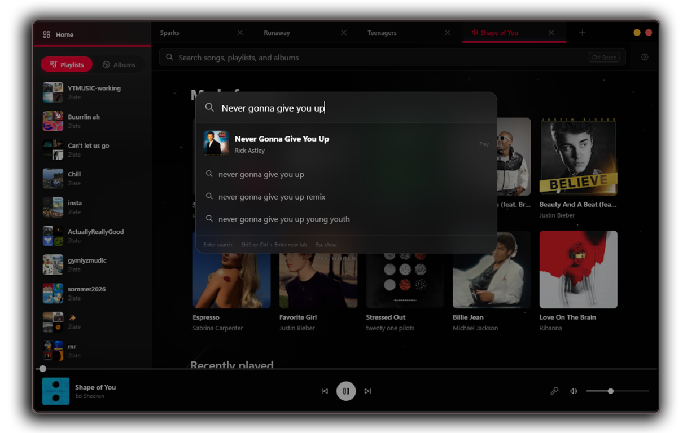

<picture>
    <source
      width="831px"
      media="(prefers-color-scheme: dark)"
      srcset="assets\img\Logo_Header_SMALLER.png"
    >
    
</picture>

A desktop YouTube Music client built with Tauri, React, and TypeScript for **Windows & (experimental) MacOs**.

> **IMPORTANT**
>
> This is an independent, unofficial project and is not affiliated with, authorized by, sponsored by, or endorsed by YouTube or Google. The only reason I am making this, is becuase there is no official YouTube music desktop client. 
> 
>

If you like this project, **starring it on Github** would help A LOT!
## About ℹ️

JustAnotherMusicClient brings YouTube Music to the desktop in a focused, native-feeling application. YouTube does not provide an official desktop client, so this project aims to provide a polished alternative that integrates with YouTube Music while keeping the experience fast and familiar.

<source
      width="831px"
      media="(prefers-color-scheme: dark)"
      srcset="assets\img\Screenshot01.png"
    >
    

## Features ✨
| Feature  | Description |
|---|---|
| Multiple Tabs | Create multiple music tabs, each with its own playback queue, volume, and player state |
| Add free | They aren't even fetched, so you won't waste any data |
| Caching | Playlists, lyrics, and more are cached for significantly faster performance |
| Recommendations | Home Tab with personalized song sugesstions and a "random" shuffle wheel, just like on the mobile client |
| Synced Lyrics | Real-time synced lyrics, not even available on the official client |
| YouTube Music Integration | Browse, search, and play music via an integrated search bar |
| Account Support | Sign in to access your library, playlists, recommendations, and other account features |
| Song Management | Add songs to playlists or queue quickly via Ctrl+S or right-click |
## Download ⏬

Download the **newest available installer** from the [latest release](https://github.com/2latemc/JustAnotherMusicClient/releases/latest) for either Windows or MacOs.
<a href="https://github.com/2latemc/JustAnotherMusicClient/releases/latest">
  <picture>
    <source
      width="831px"
      media="(prefers-color-scheme: dark)"
      srcset="assets/img/Screenshot02.png"
    >
    
  </picture>
</a>

## Roadmap 📌
- **Better lyrics consistency** (some songs still don't have them)
- **Artist Pages** with monthly listeners, playlists and popular songs alongside streams amount feature when clicking on the artist name, also integrate into the search results so that one can find artists
- **Liked songs** playlist support
- Fix Windows media player controls sometimes not working
- **Music Video** support

- Space to pause sometimes selects elements instead of pausing / resuming
- Cap Too long Song names and make them smoothly move vertically

## Platform Support 💻

- **Windows** is the primary supported platform.
- **macOS** support is experimental and may have incomplete features or platform-specific issues.
- **Linux** honestly haven't tried it. Should work if you compile it from source? If someone tries let me know!
### MacOs Issues
**MacOs may prompt you with a Keychain popup asking for permission.** The app stores one encryption key in its own Keychain entry. Your YouTube Music session is encrypted with that key before it is saved in the app data directory.

If you do not need signing into YouTube Music you dont need to grant Keychain permissions. If you do it is recommended to click "always allow" in the popup to prevent MacOs from being annoying 

## Third-Party Services 
**If anyone from Google reads this:** There was no official client, I just wanted a good desktop client. Thats why I made this, please don't sue me!

The application interacts with YouTube and YouTube Music. Access to those services remains governed by their respective terms, policies, availability, and regional restrictions.

JustAnotherMusicClient does not host or claim ownership of music, videos, artwork, metadata, or other content supplied by third parties. Rights in that content remain with their respective owners.

The project is not intended to circumvent access controls, geographic restrictions, advertising, paid service requirements, or content licensing. It is also not intended to enable unauthorized downloading, copying, redistribution, or public performance of third-party content.

YouTube and YouTube Music are trademarks of Google LLC. All other trademarks are the property of their respective owners. References to third-party products are used only to describe compatibility and integration.

- [YouTube Terms of Service](https://www.youtube.com/static?template=terms)
- [YouTube API Services Terms of Service](https://developers.google.com/youtube/terms/api-services-terms-of-service)
- [YouTube API Services Developer Policies](https://developers.google.com/youtube/terms/developer-policies)


## For Developers 🛠️

### Prerequisites

Install these before running the app:

- Node.js LTS and npm
- [Rust and Cargo](https://rustup.rs/)
- Windows C++ build tools
- Microsoft Edge WebView2 Runtime

The Tauri CLI is included in the project's development dependencies. A global Tauri installation is not required.


### Install

```powershell
npm install
```

### Run

```powershell
npm run tauri dev
```

### Build

```powershell
npm run tauri build
```

### Contributing

Contributions are welcome. Fork the repository, create a branch for your change, test it locally, and open a pull request with a clear description of what you changed and why.

By submitting a contribution, you agree to the [Contributor License Agreement](CLA.md). You retain copyright in your contribution while granting the project owner the rights needed to use, modify, distribute, commercialize, and relicense it.

For larger changes, consider opening an issue first so the approach can be discussed before implementation.

### Common Issues

#### Rust is not installed

Install Rust and Cargo from [rustup.rs](https://rustup.rs/), restart your terminal, and run the command again.

#### WebView2 is missing

Install the [Microsoft Edge WebView2 Runtime](https://developer.microsoft.com/en-us/microsoft-edge/webview2/), then run the app again.
